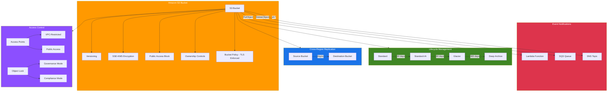

# terraform-aws-s3-bucket

Production-grade Terraform module for AWS S3 buckets with comprehensive security controls, intelligent tiering, replication, object lock, access points, and event notifications.

## Architecture



## Features

- Server-side encryption (SSE-S3 or SSE-KMS with bucket key)
- Versioning with optional MFA Delete
- Public access block (all four settings)
- TLS enforcement via bucket policy (denies HTTP and TLS < 1.2)
- Lifecycle rules with Intelligent Tiering support
- Cross-region and same-region replication
- Object Lock (WORM) with GOVERNANCE or COMPLIANCE modes
- CORS configuration for web applications
- Static website hosting
- Event notifications to Lambda, SQS, and SNS
- S3 Access Points with optional VPC restriction
- BucketOwnerEnforced ownership controls
- Custom bucket policy with automatic TLS policy merging

## Usage

### Minimal (Secure Defaults)

```hcl
module "s3_bucket" {
  source = "github.com/kogunlowo123/terraform-aws-s3-bucket"

  bucket_name = "my-secure-bucket"

  tags = {
    Environment = "production"
  }
}
```

### With KMS Encryption and Lifecycle Rules

```hcl
module "s3_bucket" {
  source = "github.com/kogunlowo123/terraform-aws-s3-bucket"

  bucket_name       = "my-app-data"
  enable_encryption = true
  kms_key_arn       = aws_kms_key.s3.arn

  lifecycle_rules = [
    {
      id      = "intelligent-tiering"
      enabled = true
      prefix  = ""
      transitions = [
        { days = 0, storage_class = "INTELLIGENT_TIERING" },
      ]
    },
    {
      id      = "archive-old-versions"
      enabled = true
      prefix  = ""
      noncurrent_version_transitions = [
        { days = 30, storage_class = "STANDARD_IA" },
        { days = 60, storage_class = "GLACIER" },
      ]
      noncurrent_version_expiration = { days = 180 }
    },
  ]
}
```

### With Replication

```hcl
module "s3_bucket" {
  source = "github.com/kogunlowo123/terraform-aws-s3-bucket"

  bucket_name        = "my-primary-bucket"
  enable_replication = true
  replication_role_arn = aws_iam_role.replication.arn

  replication_rules = [
    {
      id                 = "replicate-all"
      status             = "Enabled"
      priority           = 1
      destination_bucket = module.replica.bucket_arn
    },
  ]
}
```

See the [examples/](./examples/) directory for complete, runnable configurations.

## Requirements

| Name | Version |
|------|---------|
| terraform | >= 1.5.0 |
| aws | >= 5.20.0 |

## Resources

| Name | Type |
|------|------|
| aws_s3_bucket.this | resource |
| aws_s3_bucket_ownership_controls.this | resource |
| aws_s3_bucket_versioning.this | resource |
| aws_s3_bucket_server_side_encryption_configuration.this | resource |
| aws_s3_bucket_public_access_block.this | resource |
| aws_s3_bucket_logging.this | resource |
| aws_s3_bucket_lifecycle_configuration.this | resource |
| aws_s3_bucket_replication_configuration.this | resource |
| aws_s3_bucket_object_lock_configuration.this | resource |
| aws_s3_bucket_cors_configuration.this | resource |
| aws_s3_bucket_website_configuration.this | resource |
| aws_s3_bucket_notification.this | resource |
| aws_s3_access_point.this | resource |
| aws_s3_bucket_policy.this | resource |
| aws_region.current | data source |
| aws_caller_identity.current | data source |
| aws_iam_policy_document.tls_enforcement | data source |
| aws_iam_policy_document.custom | data source |
| aws_iam_policy_document.combined | data source |

## Inputs

| Name | Description | Type | Default | Required |
|------|-------------|------|---------|----------|
| bucket_name | The name of the S3 bucket. Must be globally unique. | `string` | `null` | no |
| bucket_prefix | Creates a unique bucket name with the specified prefix. | `string` | `null` | no |
| force_destroy | Allow Terraform to destroy non-empty buckets. | `bool` | `false` | no |
| enable_versioning | Enable bucket versioning. | `bool` | `true` | no |
| mfa_delete | Enable MFA Delete (must be set by root account). | `bool` | `false` | no |
| enable_encryption | Enable server-side encryption. | `bool` | `true` | no |
| kms_key_arn | KMS key ARN for SSE-KMS. Null uses AES-256. | `string` | `null` | no |
| block_public_access | Enable all four public access block settings. | `bool` | `true` | no |
| enable_logging | Enable server access logging. | `bool` | `false` | no |
| logging_target_bucket | Target bucket for access logs. | `string` | `null` | no |
| logging_target_prefix | Prefix for access log objects. | `string` | `null` | no |
| lifecycle_rules | List of lifecycle rule configurations. | `list(object)` | `[]` | no |
| enable_replication | Enable cross-region or same-region replication. | `bool` | `false` | no |
| replication_role_arn | IAM role ARN for replication. | `string` | `null` | no |
| replication_rules | List of replication rule configurations. | `list(object)` | `[]` | no |
| enable_object_lock | Enable Object Lock (WORM). Must be set at creation. | `bool` | `false` | no |
| object_lock_mode | Default Object Lock retention mode (GOVERNANCE or COMPLIANCE). | `string` | `"GOVERNANCE"` | no |
| object_lock_days | Default Object Lock retention period in days. | `number` | `30` | no |
| cors_rules | List of CORS rule configurations. | `list(object)` | `[]` | no |
| enable_website | Enable static website hosting. | `bool` | `false` | no |
| index_document | Index document for website hosting. | `string` | `"index.html"` | no |
| error_document | Error document for website hosting. | `string` | `"error.html"` | no |
| event_notifications | Event notification configuration for Lambda, SQS, and SNS. | `object` | `{}` | no |
| access_points | Map of S3 Access Point configurations. | `map(object)` | `{}` | no |
| bucket_policy | Custom bucket policy JSON document. | `string` | `null` | no |
| enforce_tls | Enforce TLS (HTTPS) via bucket policy. | `bool` | `true` | no |
| tags | Map of tags to assign to all resources. | `map(string)` | `{}` | no |

## Outputs

| Name | Description |
|------|-------------|
| bucket_id | The name of the bucket |
| bucket_arn | The ARN of the bucket |
| bucket_domain_name | The bucket domain name (bucket-name.s3.amazonaws.com) |
| bucket_regional_domain_name | The bucket region-specific domain name |
| bucket_hosted_zone_id | The Route 53 Hosted Zone ID for the bucket's region |

## Security Considerations

This module is designed to align with the following security benchmarks and best practices:

### CIS AWS Foundations Benchmark

| Control | Description | Default |
|---------|-------------|---------|
| 2.1.1 | S3 bucket server-side encryption enabled | Enabled |
| 2.1.2 | S3 bucket policy set to deny HTTP requests | Enforced |
| 2.1.5 | S3 buckets configured with Block Public Access | Enabled |
| 3.6 | S3 bucket access logging enabled | Configurable |

### AWS Security Hub (S3 Controls)

- **S3.1**: Block public access settings should be enabled
- **S3.2**: Buckets should prohibit public read access
- **S3.3**: Buckets should prohibit public write access
- **S3.4**: Buckets should have server-side encryption enabled
- **S3.5**: Buckets should require SSL for requests
- **S3.6**: Bucket policies should restrict cross-account access
- **S3.8**: Block public access at the bucket level
- **S3.9**: Server access logging should be enabled
- **S3.10**: Versioning enabled buckets should have lifecycle policies
- **S3.11**: Event notifications should be enabled
- **S3.13**: Buckets should have lifecycle policies configured

### Recommendations

1. Always enable versioning and encryption (module defaults)
2. Enable access logging for audit trails
3. Use KMS keys for sensitive data (provides audit trail via CloudTrail)
4. Enable Object Lock for compliance-critical data
5. Use VPC-restricted Access Points for network isolation
6. Implement lifecycle rules to manage costs
7. Enable replication for disaster recovery

## Cost Estimation

| Feature | Cost Impact |
|---------|-------------|
| S3 Standard Storage | ~$0.023/GB/month (us-east-1) |
| Intelligent Tiering | Monitoring fee: $0.0025 per 1,000 objects |
| Standard-IA | ~$0.0125/GB/month (min 128KB, 30 days) |
| Glacier Instant Retrieval | ~$0.004/GB/month |
| Glacier Flexible Retrieval | ~$0.0036/GB/month |
| Deep Archive | ~$0.00099/GB/month |
| KMS Encryption | $1/month per key + $0.03 per 10,000 requests |
| Replication | Data transfer out charges apply |
| Access Logging | Storage costs for log objects |

Prices are approximate and vary by region. See [AWS S3 Pricing](https://aws.amazon.com/s3/pricing/) for current rates.

## References

- [AWS S3 Documentation](https://docs.aws.amazon.com/s3/index.html)
- [Terraform AWS Provider - S3](https://registry.terraform.io/providers/hashicorp/aws/latest/docs/resources/s3_bucket)
- [CIS AWS Foundations Benchmark](https://www.cisecurity.org/benchmark/amazon_web_services)
- [AWS Security Hub S3 Controls](https://docs.aws.amazon.com/securityhub/latest/userguide/s3-controls.html)
- [S3 Intelligent Tiering](https://aws.amazon.com/s3/storage-classes/intelligent-tiering/)
- [S3 Object Lock](https://docs.aws.amazon.com/AmazonS3/latest/userguide/object-lock.html)
- [S3 Access Points](https://docs.aws.amazon.com/AmazonS3/latest/userguide/access-points.html)

## License

MIT Licensed. See [LICENSE](./LICENSE) for full details.
